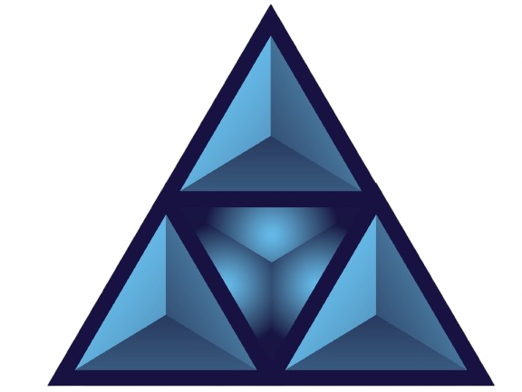
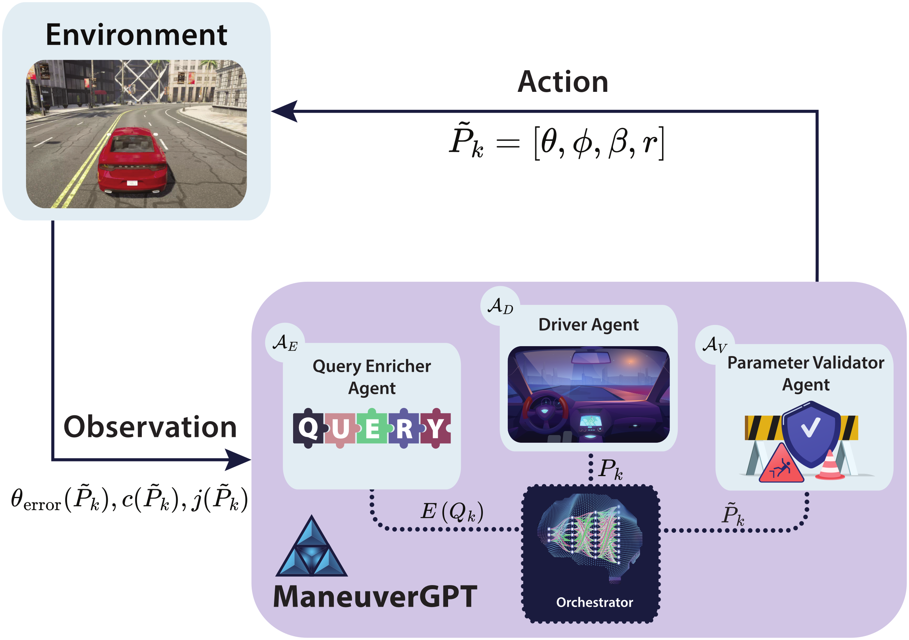
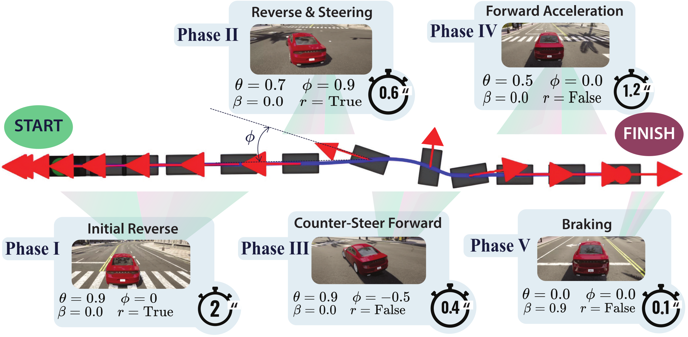

<p align="center">
  
</p>

<h1 align="center">ManeuverGPT</h1>

<p align="center">
  <a href="https://www.youtube.com/playlist?list=PLMcjQ-k9Bg8RPpmOUefSjn8F1C1TC2hTX" target="_blank">
    
  </a>
  
  <a href="https://arxiv.org/abs/2503.09035" target="_blank">
    
  </a>
  <a href="https://shi-on.github.io/ManeuverGPT/" target="_blank">
    
  </a>
</p>

<h3 align="center">Agentic Control for Safe Autonomous Stunt Maneuvers</h3>

<p align="center">
  
  

  <br>
  <em>Agentic Control Diagram &nbsp;&nbsp;|&nbsp;&nbsp; Maneuver Phases Overview</em>
</p>


📣 **Announcements**:

- **January 2026 — Version 1.3.1 released**  
  Version 1.3.1 released with major changes. See the GitHub Release [here](https://github.com/SHi-ON/ManeuverGPT/releases/latest).
- **July 2025 — Paper updated**  
  The paper has been updated for the final submission to IROS 2025. See the updated version [here](https://github.com/SHi-ON/ManeuverGPT/blob/main/ManeuverGPT.pdf).
- **June 2025 — Paper Accepted to IROS 2025! 🎉**  
  We are excited to announce that our paper has been **accepted for publication at the IEEE/RSJ International Conference on Intelligent Robots and Systems (IROS) 2025**, and it has been selected for an **oral presentation**! We appreciate your interest in our work!

---

## Overview

**ManeuverGPT** is an Agentic framework for generating and executing
high-dynamic stunt maneuvers in autonomous vehicles using Large Language
Model (LLM)-based agents as controllers.
This repository provides the implementation of
ManeuverGPT, including its multi-agent architecture, control pipeline, and
experimental evaluations in the **CARLA** simulator.

## Key Features

- **Agentic Architecture:** Comprises three specialized LLM-driven agents:
    - **Query Enricher Agent**: Contextualizes user commands for maneuver
      generation.
    - **Driver Agent**: Generates maneuver parameters based on enriched
      queries.
    - **Parameter Validator Agent**: Enforces physics-based and safety
      constraints.
- **High-Dynamic Maneuver Execution:** Enables vehicles to perform complex
  stunt maneuvers such as **J-turns** with textual prompt-based control.
- **Simulation-Based Evaluation:** Tested in **CARLA v0.9.14** to ensure
  maneuver feasibility across different vehicle models.
- **Adaptive Prompting Mechanism:** Allows maneuver refinement without
  requiring retraining of model weights.
- **Multi-Agent Collaboration:** Improves execution success and precision
  compared to single-agent approaches.

## Installation

### Prerequisites

- **Python 3.10+**
- **CARLA Simulator v0.9.14**
- **Chat Completion-compatible LLM API** (e.g., GPT-4o, etc.)

### Setup

Clone the repository and install dependencies:

```sh
git clone https://github.com/SHi-ON/ManeuverGPT.git
cd ManeuverGPT
uv sync
```

Ensure **CARLA** is installed and running before executing the scripts.

## Running Experiments

### J-Turn Execution (Autonomous Pipeline)

This is the closest path to the full demo behavior: LLM agents generate a
validated maneuver, push it to Redis, and the CARLA client executes it.

1. **Start CARLA** (server running on `localhost:2000`).
2. **Start Redis** (default `localhost:6379`).
3. **Set your LLM key**:

```sh
export OPENAI_API_KEY="..."
```

4. **Run the orchestrator** (generates and enqueues maneuvers):

```sh
python -m maneuvergpt.carla.orchestrator \
  --mode online \
  --iterations 5 \
  --redis_queue maneuver_queue \
  --user_input "Generate a safe J-turn in an open lot"
```

5. **Run the CARLA control client** (executes maneuvers from Redis):

```sh
python -m maneuvergpt.carla.drive \
  --mode online \
  --redis_queue maneuver_queue \
  --sync
```

Notes:
- The **manual control HUD window** is the "maneuver control interface" in the
  video. Use `H` / `?` for help, and press `J` to trigger a J-turn immediately
  if one is queued. Otherwise, the client will auto-start when a maneuver arrives.
- The **Redis queue name must match** between orchestrator and drive.

### Offline Execution (From a JSON File)

If you already have a validated maneuver file, you can execute it directly:

```sh
python -m maneuvergpt.carla.maneuvers \
  --mode offline \
  --params maneuver_outputs/iteration_1/validated_maneuver_1.json
```

### CLI Help

```sh
python -m maneuvergpt.carla.drive --help
python -m maneuvergpt.carla.orchestrator --help
python -m maneuvergpt.carla.maneuvers --help
```

## Citation

If you use ManeuverGPT in your research, please cite:

```bibtex
@article{Azdam_ManeuverGPT_Agentic_Control_2025,
  author = {Azdam, Shawn and Doma, Pranav and Arab, Aliasghar Moj},
  journal = {arXiv preprint arXiv:2503.09035},
  title = {{ManeuverGPT Agentic Control for Safe Autonomous Stunt Maneuvers}},
  url = {https://arxiv.org/abs/2503.09035},
  year = {2025}
}
```

## License

This project is licensed under the **CC BY 4.0**.
